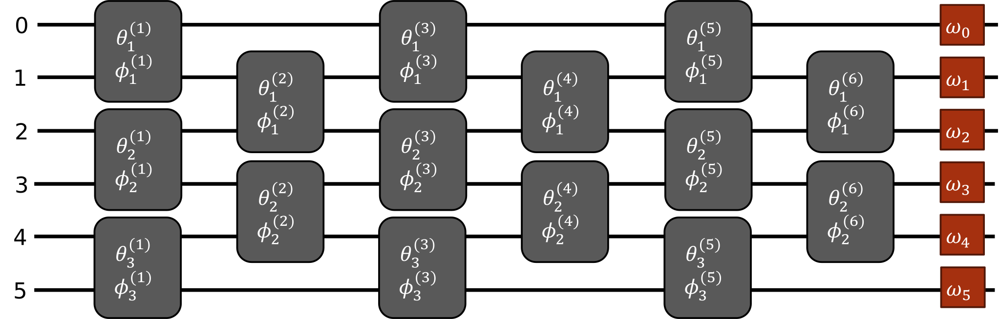
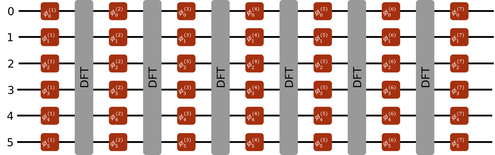

[](https://arxiv.org/abs/arXiv:2508.20010)

# Unitary-Decomp

Decomposition algorithms for linear optical unitaries.

## Table of Contents

- [About this project](#about-this-project)
- [Installation](#installation)
- [Usage](#usage)
- [Papers](#papers)
- [License](#license)

## About this project

`Unitary-Decomp` is a simple **Python** package that allows to perform various **decompositions of unitary matrices** in terms of simple optical components. These decompositions can be used to design and program **universal multiport interferometers**, devices capable of implementing arbitrary linear transformations on a set of $N$ optical modes. Such devices have numerous applications in communication, imaging, and information processing.

The decompositions provided in this package can be classified in two types: [***Interferometer*** Designs](#interferometer-designs) and [***Fourier Transform*** Designs](#fourier-transform-designs).


### Interferometer Designs
This type of decomposition seeks to express a $N \times N$ unitary matrix as a planar mesh of configurable unit cells, which can be made of simple optical components. The first design of this kind was proposed by [Reck *et al.*, 1994](https://doi.org/10.1103/PhysRevLett.73.58), who used a triangular mesh of asymmetric Mach–Zehnder interferometers to implement arbitrary unitary transformations. This design was later improved by [Clements *et al.*, 2016](https://doi.org/10.1364/OPTICA.3.001460), who introduced a more compact rectangular mesh using the same unit cells. [Bell *et al.*, 2021](https://doi.org/10.1063/5.0053421) further compactified the Clements design by using a symmetrical Mach–Zehnder interferometers as a unit cell, which reduced the optical depth of the interferometer. 

<div align="center">
Rectangular mesh of unit cells generated using the Clements decomposition algorithm for 6 modes 
</div>



`Unitary-Decomp` provides two modules to decompose unitary matrices using a mesh of 2 modes interferometers:

- [`clements_interferometer`](src/unitary_decomp/clements_interferometer.py): Implementation of the Clements algorithm ([Clements *et al.*, 2016](https://doi.org/10.1364/OPTICA.3.001460)) to decompose $N \times N$ unitary matrices into a rectangular mesh of $N(N-1)/2$ asymmetric Mach–Zehnder interferometers.

- [`bell_interferometer`](src/unitary_decomp/bell_interferometer.py): Implementation of the Bell algorithm ([Bell *et al.*, 2021](https://doi.org/10.1063/5.0053421)) to decompose $N \times N$ unitary matrices into a rectangular mesh of $N(N-1)/2$ symmetric Mach–Zehnder interferometers.


### Fourier Transform Designs

This type of decomposition aims to express a $N \times N$ unitary matrix as a sequence of phase masks interleaved with discrete Fourier transforms (DFT). The first constructive design based on this principle was proposed by [López Pastor *et al.*, 2021](https://doi.org/10.1364/OE.432787) and uses a sequence of $6N + 1$ phase masks to implement a $N \times N$ unitary. We improved this design to use $4N+1$ and $2N+5$ phase masks.

<div align="center">
Sequence of phase masks (orange) interleaved with discrete Fourier transforms (grey)
</div>



`Unitary-Decomp` provides two modules to decompose unitary matrices using phase masks and DFTs:

- [`lplm_interferometer`](src/unitary_decomp/lplm_interferometer.py): Implementation of the $6N+1$ algorithm by López Pastor, Lundeen and Marquardt ([López Pastor *et al.*, 2021](https://doi.org/10.1364/OE.432787)).

- [`fourier_interferometer`](src/unitary_decomp/fourier_interferometer.py): Implementation of the *Fourier decomposition* ($4N+1$) and *compact Fourier decomposition* ($2N+5$).

## Installation

To install the package in your Python environment, follow the following steps:


1. Clone the repository:

```bash
git clone https://github.com/polyquantique/Universal-Interferometers.git
cd Universal-Interferometers
```

2. Set up a virtual environment (Optional):

```bash
python -m venv venv
venv/Scripts/activate
```

3. Install the package:

```bash
pip install .
```
or, if you want to edit the package,
```bash
pip install -e .
```

4. Run the tests (Optional):

```bash
pip install pytest
pytest tests
```

## Usage

### 1. `clements_interferometer` module
This first example shows how to use the `clements_interferometer` module to decompose a random unitary matrix.

```python
>>> from unitary_decomp import clements_interferometer as ci
>>> from scipy.stats import unitary_group
>>> import numpy as np
```

The function `clements_decomposition` performs the decomposition described in [Clements *et al.*, 2016](https://doi.org/10.1364/OPTICA.3.001460) on a random unitary matrix `U`.
```python
>>> # Generate a random unitary matrix
>>> U = unitary_group(dim = 8, seed = 137).rvs() 

>>> # Compute the Clements decomposition
>>> decomposition = ci.clements_decomposition(U)
```

The output of this function is a `Decomposition` object, which has a `circuit` attribute. `Decomposition.circuit` is a list of `MachZehnder` objects that contain the parameters of each unit cell in the mesh.

```python
>>> # Extract the circuit from the decomposition
>>> circuit = decomposition.circuit

>>> # Print the parameters of the first unit cell in the circuit
>>> print(circuit[0])
MachZehnder(theta=np.float64(1.4362932313875947), phi=np.float64(5.25568125446807), target=(5, 6))
```

The function `circuit_reconstruction` allows to compute the matrix that correspond to a `Decomposition` object. This matrix is then compared to the original matrix.

```python
>>> # Reconstruct the unitary matrix from the decomposition
>>> reconstructed_matrix = ci.circuit_reconstruction(decomposition)

>>> # Compare with the initial matrix
>>> print(np.allclose(U, reconstructed_matrix))
True
```

### 2. `lplm_interferometer` module

This example shows how to use the `lplm_interferometer` module to decompose a random unitary matrix.

```python
>>> from unitary_decomp import lplm_interferometer as li
>>> from scipy.stats import unitary_group
>>> import numpy as np
```

The `lplm_decomposition` function performs the decomposition described in [López Pastor *et al.*, 2021](https://doi.org/10.1364/OE.432787) on a random unitary matrix `U`.

```python
>>> # Generate a random unitary matrix
>>> U = unitary_group(dim = 8, seed = 137).rvs() 

>>> # Compute the LPLM decomposition
>>> decomposition = li.lplm_decomposition(U)
```

The output is a `LplmDecomp` object, which contains the `mask_sequence` attribute. `LplmDecomp.mask_sequence` is a list of phase masks that must be interleaved with DFT matrices to reconstruct the initial unitary.

```python
>>> # Extract the mask sequence from the decomposition
>>> mask_sequence = decomposition.mask_sequence

>>> # Print the first mask in the sequence
>>> print(mask_sequence[0].round(3))
[0.707-0.707j 0.707+0.707j 0.707-0.707j 0.707+0.707j 0.707-0.707j
 0.707+0.707j 0.707-0.707j 0.707+0.707j]
```

The function `circuit_reconstruction` computes the matrix given by a `LplmDecomp` object by placing a DFT matrix between each phase masks. The matrix is then compared to the initial matrix.

```python
>>> # Reconstruct the unitary matrix from the decomposition
>>> reconstructed_matrix = li.circuit_reconstruction(decomposition)

>>> # Compare with the initial matrix
>>> print(np.allclose(U, reconstructed_matrix))
True
```
## How to cite this work
If you find our research useful in your work please cite it as:
```
@article{girouard2025,
  title={Near-optimal decomposition of unitary matrices using phase masks and the discrete Fourier transform},
  author={Girouard, Vincent and Quesada, Nicol{\'a}s},
  journal={arXiv preprint arXiv:2508.20010},
  year={2025}
}
```

## Documentation

The **LPLM algorithm** found in the [`lplm_interferometer`](src/unitary_decomp/lplm_interferometer.py) module was adapted from [López Pastor *et al.*, 2021](https://doi.org/10.1364/OE.432787) and uses a slightly different sequence of phase masks than the original paper. A comprehensive derivation of this new sequence can be found in the following document:

- [Decomposition of Unitary Matrices Using Fourier
Transforms and Phase Masks](papers/LPLM_algorithm_derivation.pdf)

## License

This project is licensed under the Apache License 2.0. See the [LICENSE](LICENSE) file for details.
